<font face="Microsoft YaHei UI">

<center><font size=7>北汽高配嵌入式代码说明</font></center>

<!-- TOC -->

- [1. 流程图](#1-%E6%B5%81%E7%A8%8B%E5%9B%BE)
  - [1.1. 主函数](#11-%E4%B8%BB%E5%87%BD%E6%95%B0)
  - [1.2. 进程](#12-%E8%BF%9B%E7%A8%8B)
    - [1.2.1. 网络](#121-%E7%BD%91%E7%BB%9C)
    - [1.2.2. 显示屏](#122-%E6%98%BE%E7%A4%BA%E5%B1%8F)
    - [1.2.3. 监测传感器](#123-%E7%9B%91%E6%B5%8B%E4%BC%A0%E6%84%9F%E5%99%A8)
    - [1.2.4. 电表](#124-%E7%94%B5%E8%A1%A8)
    - [1.2.5. 读卡器](#125-%E8%AF%BB%E5%8D%A1%E5%99%A8)
  - [1.3. 功能模块](#13-%E5%8A%9F%E8%83%BD%E6%A8%A1%E5%9D%97)
    - [1.3.1. moudel0-1：重启获取数据](#131-moudel0-1%E9%87%8D%E5%90%AF%E8%8E%B7%E5%8F%96%E6%95%B0%E6%8D%AE)
    - [1.3.2. moudel1-1：系统升级](#132-moudel1-1%E7%B3%BB%E7%BB%9F%E5%8D%87%E7%BA%A7)
    - [1.3.3. moudel2-1：接收屏幕数据并处理](#133-moudel2-1%E6%8E%A5%E6%94%B6%E5%B1%8F%E5%B9%95%E6%95%B0%E6%8D%AE%E5%B9%B6%E5%A4%84%E7%90%86)
    - [1.3.4. moudel2-2：接收并处理读卡器数据](#134-moudel2-2%E6%8E%A5%E6%94%B6%E5%B9%B6%E5%A4%84%E7%90%86%E8%AF%BB%E5%8D%A1%E5%99%A8%E6%95%B0%E6%8D%AE)
    - [1.3.5. moudel2-3：接收智能电表数据（645）](#135-moudel2-3%E6%8E%A5%E6%94%B6%E6%99%BA%E8%83%BD%E7%94%B5%E8%A1%A8%E6%95%B0%E6%8D%AE645)
    - [1.3.6. moudel2-4：接收并处理服务器数据](#136-moudel2-4%E6%8E%A5%E6%94%B6%E5%B9%B6%E5%A4%84%E7%90%86%E6%9C%8D%E5%8A%A1%E5%99%A8%E6%95%B0%E6%8D%AE)
    - [1.3.7. moudel3-1：虚拟时钟](#137-moudel3-1%E8%99%9A%E6%8B%9F%E6%97%B6%E9%92%9F)
    - [1.3.8. moudel3-2：充电枪状态检测](#138-moudel3-2%E5%85%85%E7%94%B5%E6%9E%AA%E7%8A%B6%E6%80%81%E6%A3%80%E6%B5%8B)
    - [1.3.9. moudel3-3：读取枪座温度](#139-moudel3-3%E8%AF%BB%E5%8F%96%E6%9E%AA%E5%BA%A7%E6%B8%A9%E5%BA%A6)
    - [1.3.10. moudel3-4：一键启停（锁）操作](#1310-moudel3-4%E4%B8%80%E9%94%AE%E5%90%AF%E5%81%9C%E9%94%81%E6%93%8D%E4%BD%9C)
    - [1.3.11. moudel4-1：电表数据处理](#1311-moudel4-1%E7%94%B5%E8%A1%A8%E6%95%B0%E6%8D%AE%E5%A4%84%E7%90%86)
    - [1.3.11. moudel5-1：接收蓝牙数据](#1311-moudel5-1%E6%8E%A5%E6%94%B6%E8%93%9D%E7%89%99%E6%95%B0%E6%8D%AE)

<!-- /TOC -->

# 1. 流程图

## 1.1. 主函数

<center>

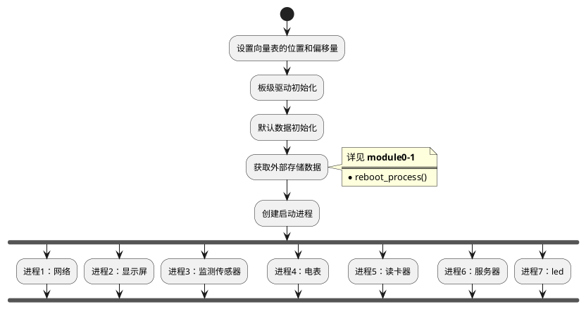
</center>

## 1.2. 进程

### 1.2.1. 网络


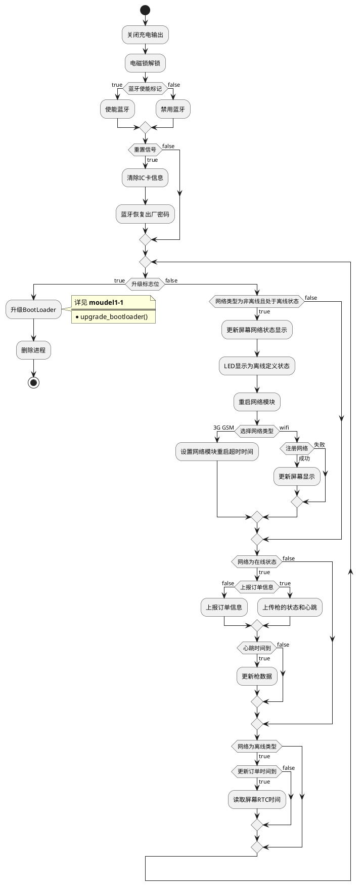


### 1.2.2. 显示屏


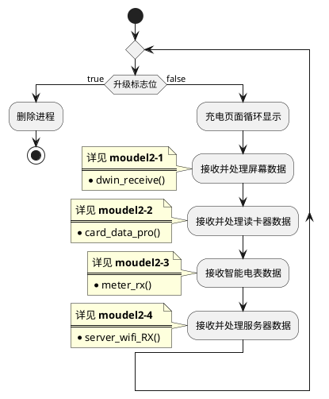

### 1.2.3. 监测传感器
<center>

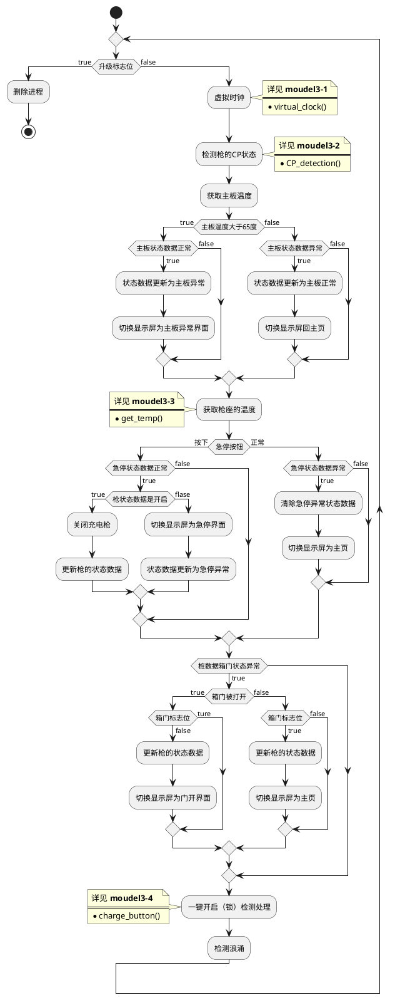

</center>

### 1.2.4. 电表

<center>

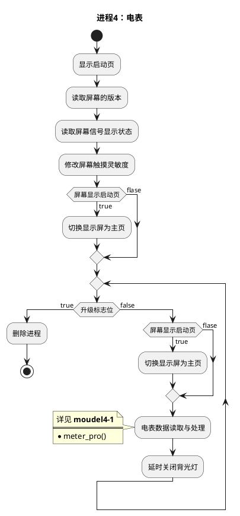
</center>

### 1.2.5. 读卡器

<center>

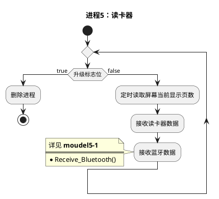
</center>

## 1.3. 功能模块

### 1.3.1. moudel0-1：重启获取数据
<center>

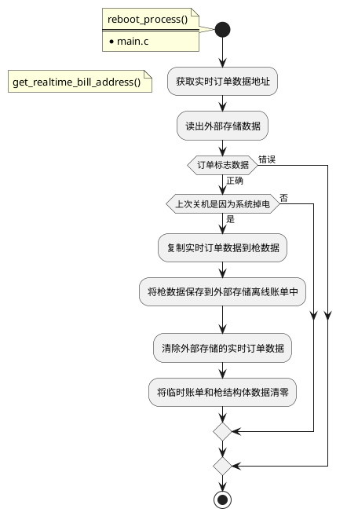

</center>

### 1.3.2. moudel1-1：系统升级
<center>

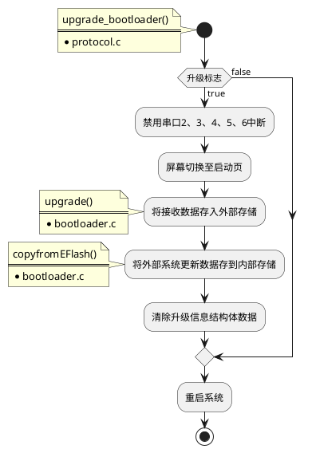

</center>

### 1.3.3. moudel2-1：接收屏幕数据并处理

<center>

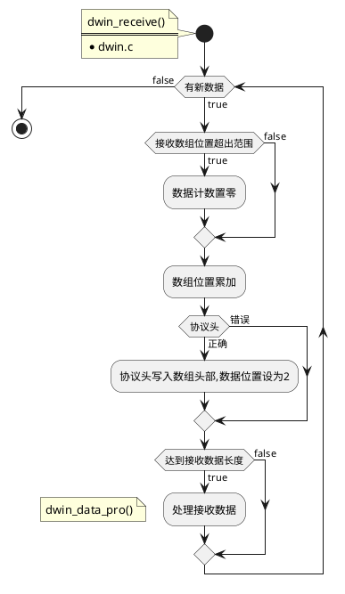
</center>

### 1.3.4. moudel2-2：接收并处理读卡器数据
<center>

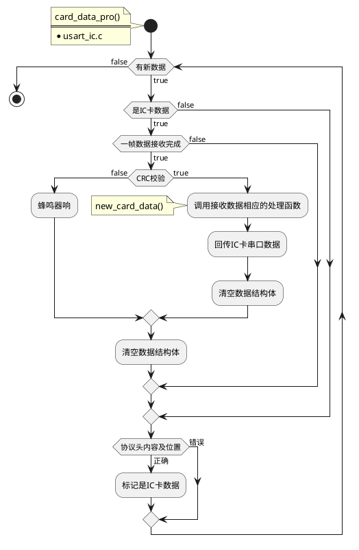

</center>

### 1.3.5. moudel2-3：接收智能电表数据（645）
<center>

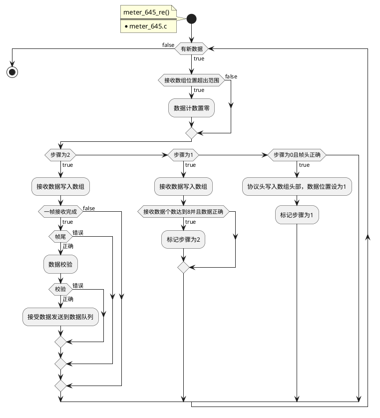

</center>

### 1.3.6. moudel2-4：接收并处理服务器数据

<center>

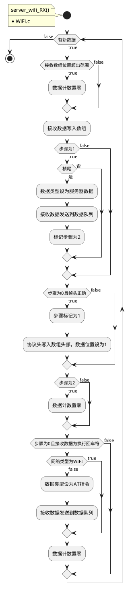

</center>

</center>

### 1.3.7. moudel3-1：虚拟时钟

<center>

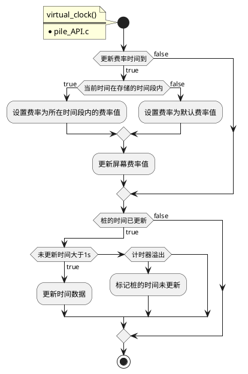

</center>

### 1.3.8. moudel3-2：充电枪状态检测

> 详细流程请查看国标文档

> ~~描述
| gun_op_step | CP                            | 动作                               | 描述                           |
|-------------|-------------------------------|------------------------------------|--------------------------------|
| 0           |                               |                                    | 空闲，未连接                    |
|             | <font color=red>变为6V</font> | step从0设为1                       | 6V电平状态只在无S2的情况下存在 |
| 1           |                               | 刷卡后step设为2，或低配直接自动充电 | 连接但未充电状态               |
| 2           |                               | 开始充电，step设为4                 |                                |
在温度检测里，3 4 11 是充电状态，需要关闭
5是关闭~~

<center>

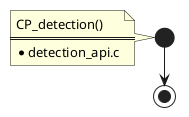
</center>

### 1.3.9. moudel3-3：读取枪座温度

<center>

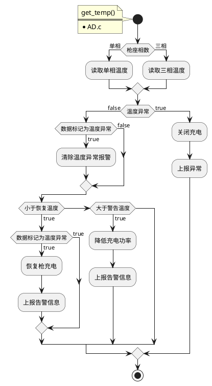

</center>

### 1.3.10. moudel3-4：一键启停（锁）操作

<center>

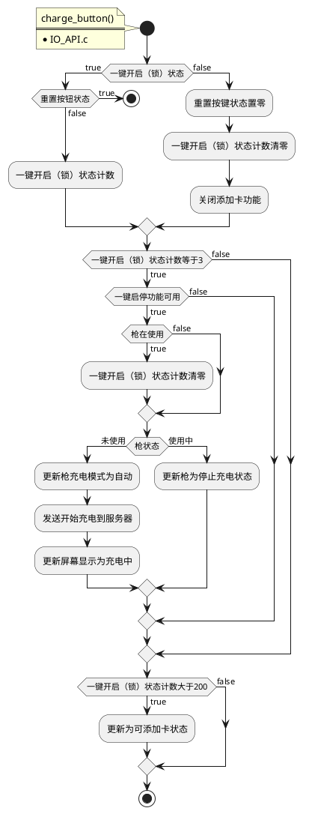

</center>

### 1.3.11. moudel4-1：电表数据处理

<center>

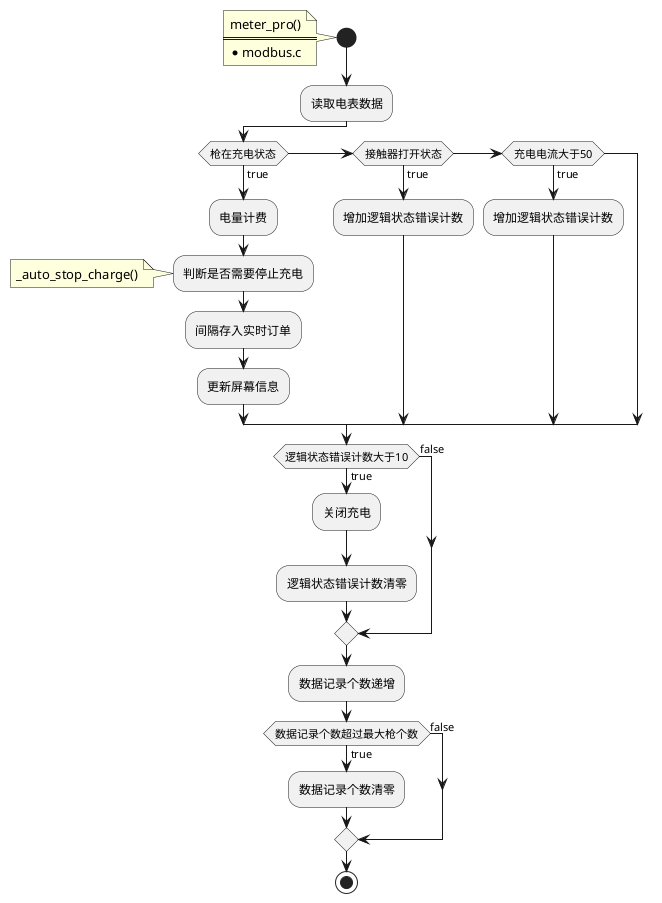

</center>

### 1.3.11. moudel5-1：接收蓝牙数据

<center>

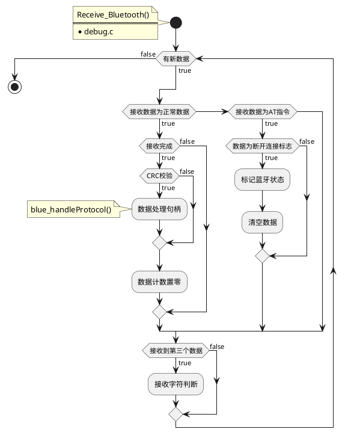

</center>
<center>

```plantuml

```

</center>


</font>
